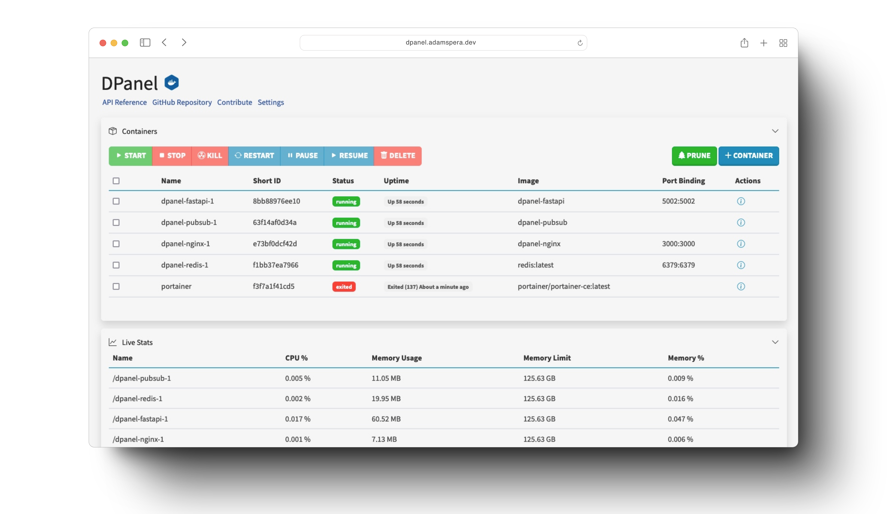

# DPanel

DPanel is a web interface leveraging FastAPI, Redis, Go PubSub, and Nginx to manage Docker processes, including containers, images, and volumes, with real-time statistics.

<!-- Main Image -->


### Architecture

*Solid line: connections and requests | Dashed line: publish-subscribe paths*

<div style="width: 75%; margin: 0 auto;">
    
</div>

## Usage

Navigate to http://localhost:5002 on a browser.

## Installation

Copy and run the following compose file:

```yaml
version: "3.9"

services:
  pubsub:
    image: breyr/dpanel-pubsub-go
    volumes:
      - /var/run/docker.sock:/var/run/docker.sock
    restart: on-failure
    depends_on:
      - redis
    extra_hosts:
      - "host.docker.internal:host-gateway"
  fastapi:
    image: breyr/dpanel-fastapi
    ports:
      - 5002:5002
    volumes:
      - /var/run/docker.sock:/var/run/docker.sock
      - composefiles:/app/composefiles
    restart: on-failure
    depends_on:
      - redis
    extra_hosts:
      - "host.docker.internal:host-gateway"
  redis:
    image: redis:latest
    ports:
      - 6379:6379
    extra_hosts:
      - "host.docker.internal:host-gateway"

volumes:
  composefiles:
```
