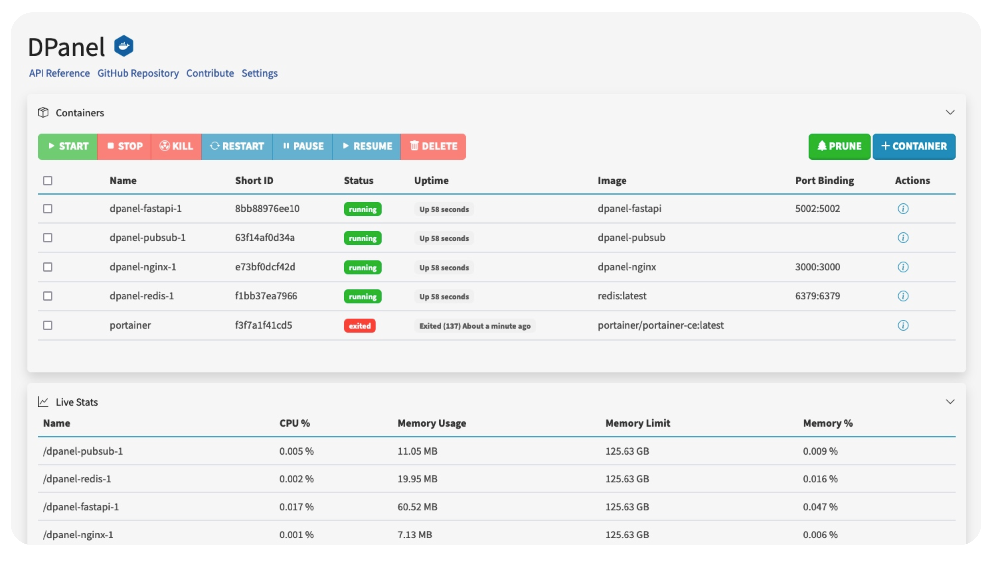
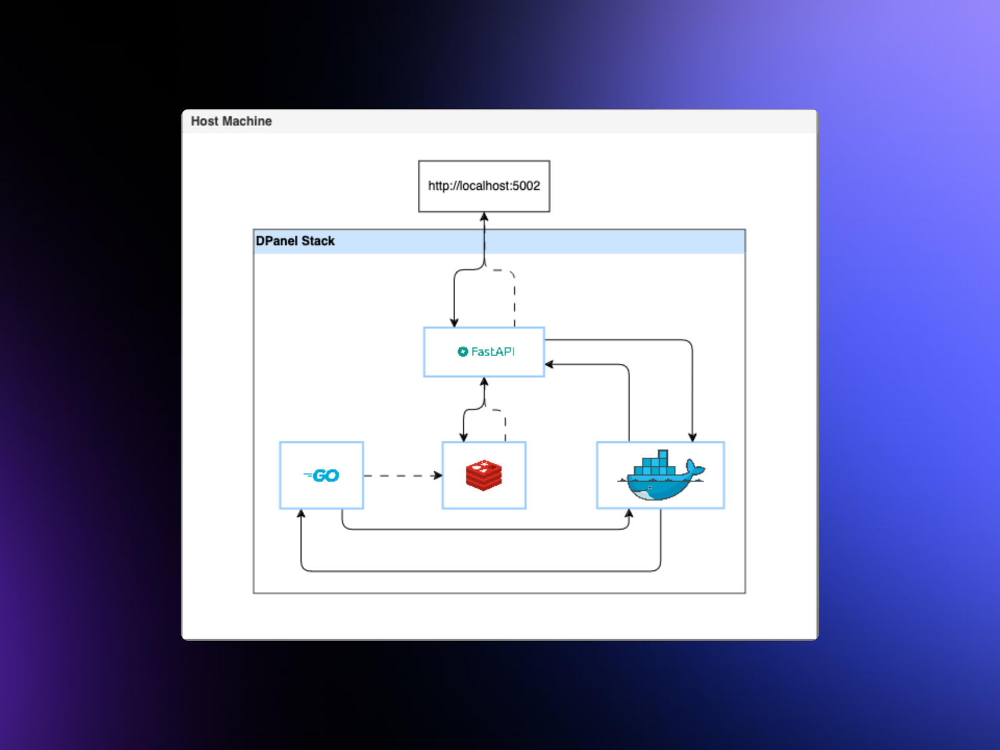
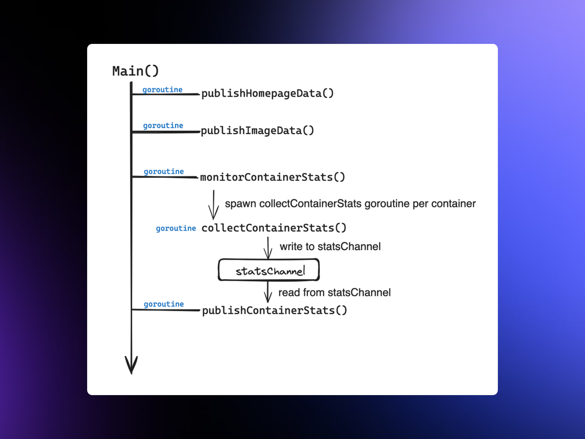

# DPanel

DPanel is a web interface leveraging FastAPI, Redis, Go PubSub, and Nginx to manage Docker processes, including containers, images, and volumes, with real-time statistics.

<!-- Main Image -->


## Features

### Key Uses

- **Container Management**: Start, stop, kill, restart, pause, resume, and remove containers.
- **Prune Selectively**: Easily prune containers, images, and volumes, depending on your needs.
- **Customize New Containers**: Create and run containers with custom configurations with networks, env variables, and volumes.
- **Image Management**: Pull and remove images all in one window, without commands.
- **Live Statistics**: View real-time statistics for containers, including CPU, memory, and network usage.
- **Upload and Compose**: Upload Docker Compose files and run them with a single click, and save for later use.

### Flexibility

- **Localhost**: Run DPanel on your local machine.
- **Domain Name**: Connect to a LAN accessible server and access it from DNS.
- **Reverse TCP**: Use Cloudflared to tunnel DPanel to a public domain.

### Web Interface

<div style="display: flex; justify-content: space-between;">
    
    
</div>

<div style="display: flex; justify-content: space-between; margin-top: 10px;">
    
    
    
</div>


### Architecture

- **Solid line**: connections and requests
- **Dashed line**: publish-subscribe paths*

<div style="display: flex; justify-content: space-between; margin-top: 10px;">
    
    
</div>

## Usage

### Running Locally

1. Navigate to http://localhost:5002 on a browser.

### Running over LAN

1. Navigate to https://dpanel.<server-ip>.com on a browser.

### Running over Cloudflared

1. Navigate to https://dpanel.<domain>.com on a browser.

## Installation

1. Clone the GitHub repo with ```git clone https://github.com/breyr/dpanel.git```.
2. Navigate into the directory with ```cd dpanel```.
3. Start the Docker containers with ```docker compose -f compose.prod.yaml up --build```.

*You only have to append the ```--build``` flag when running for the first time.*

