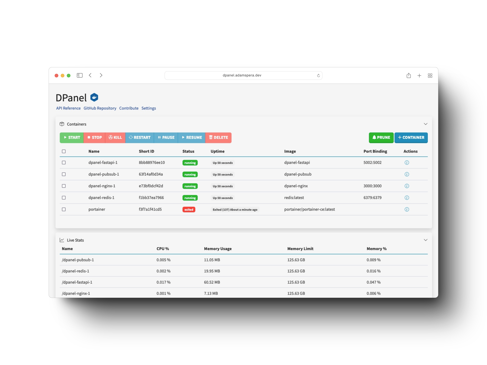

# DPanel

DPanel is a web interface leveraging FastAPI, Redis, Go PubSub, and Nginx to manage Docker processes, including containers, images, and volumes, with real-time statistics.



### Architecture

*Solid line: connections and requests | Dashed line: publish-subscribe paths*

<div style="width: 75%; margin: 0 auto;">
    
</div>

## Usage

Navigate to http://localhost:5002 on a browser.

## Installation

1. Clone the GitHub repo with ```git clone https://github.com/breyr/dpanel.git```.
2. Navigate into the directory with ```cd dpanel```.
3. Start the Docker containers with ```docker compose -f compose.prod.yaml up --build```.

*You only have to append the ```--build``` flag when running for the first time.*

## Specifications

Ports used by each service:

- Nginx: 3000
- FastAPI: 5002
- Reddis: 6379
